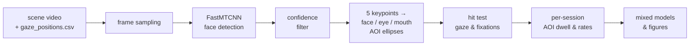
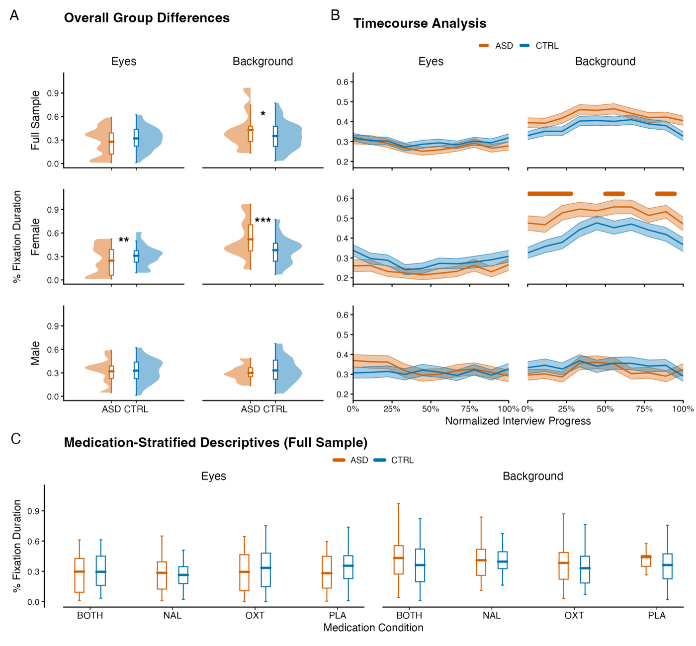

# Face Detection & Gaze Analysis Pipeline

Code for a mobile eye-tracking study of social gaze during live conversation.
Participants wore a head-mounted eye tracker while talking to another person, so
the region to be measured — the partner's face — moves continuously in the scene
camera. There is no static area of interest to draw.

This pipeline solves that in two stages: **computer vision** locates the face in
every frame and turns it into moving areas of interest, then an **R pipeline**
turns the resulting gaze streams into datasets, mixed models and figures.

## The detection stage

Faces are detected per frame with a strided MTCNN; the five returned keypoints
define three areas of interest — the whole face, the eye region and the mouth —
as ellipses that track the face as it moves. Every gaze sample and every fixation
is then tested against each ellipse.

Real annotated frames cannot be published: the scene camera shows the
participant's conversation partner, with the participant's gaze drawn on top.
The figure below is generated by `00_detection/demo/make_demo_figure.py`, which
reuses the pipeline's own drawing geometry over a schematic stand-in face and an
invented gaze path — same colours and same hit-test semantics, no data.

Orange marks the face AOI, red the eyes, blue the mouth. The faint orange trail
is the gaze path, the cyan circle a fixation. The labels on the right report,
per sample, which AOIs were hit.

## The analysis stage

The detection output becomes a session-level dataset that is merged with
questionnaires, salivary cortisol and trial metadata, then analysed with
mixed-effects models. The study is a within-subject pharmacological trial
(oxytocin, naltrexone, both, placebo) comparing autistic and non-autistic
participants, with the gaze measures as the primary outcome.

Panel A contrasts the groups on the proportion of fixation duration to the eyes
and to the background; panel B follows the same measures across the normalised
course of the conversation, with bars marking intervals that survive correction;
panel C breaks the result down by drug condition. A timecourse-only version is in
[`docs/figure3-timecourse.png`](docs/figure3-timecourse.png).

## Layout

| Path | |
|---|---|
| `00_detection/` | Python — MTCNN detection, AOI construction, gaze/fixation mapping |
| `00_detection/demo/` | Generates the synthetic figure above |
| `01_analysis/` | R — preprocessing, dataset assembly, models, figures, tables |
| `02_outputs/` | Model outputs, figures and tables (aggregate only) |
| `config/` | Path templates; copy to `paths.R` / `paths.py` for your machine |

`01_analysis/` runs in numbered stages: `00_preprocessing` → `01_dataset_assembly`
→ `02_main_manuscript` → `03_supplementary` → `04_figures` → `05_tables`.

## Data

**No participant data is in this repository and none will be.** The measures are
health-related — clinical group, medication, questionnaire and cortisol data — and
individual-level records stay in a private repository under the study's ethics
approval.

What that means in practice: `02_outputs/` holds aggregate results only, and the
scripts expect a `00_data/` directory that is not distributed. Fitted model
objects are excluded too, since a fitted model carries its model frame — and with
it the underlying rows — inside the saved object.

The code is therefore readable and reviewable end to end, but not runnable
without the data.

## Provenance

Eye-tracking and analysis code from a clinical trial run at the University of
Vienna. Python dependencies are in `00_detection/requirements.txt`; the R side
uses `tidyverse`, `here`, `emmeans`, `glmmTMB`, `lmerTest`, `car`, `ggh4x` and
`patchwork`.
