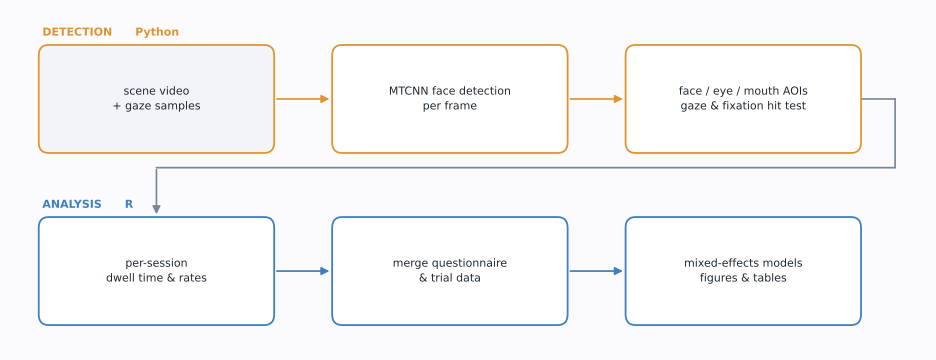
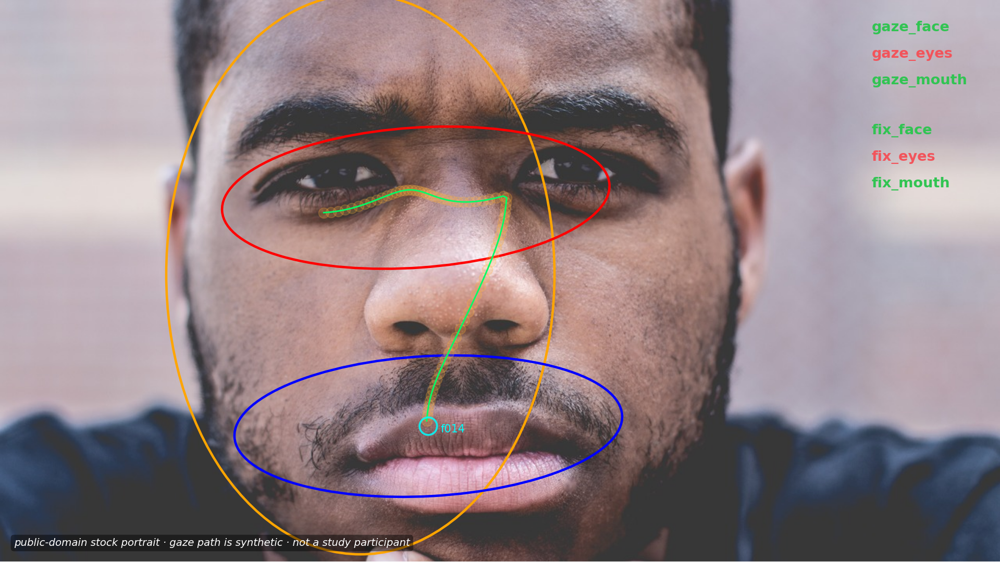

# Face Detection & Gaze Analysis Pipeline

Code for a computer-vision assisted eye-tracking study of social gaze during live conversation.
Participants wore a head-mounted eye tracker while talking to another person, so
the region to be measured — the partner's face — moves continuously in the scene
camera. There is no static area of interest to draw.

This pipeline solves that in two stages: **computer vision** locates the face in
every frame and turns it into moving areas of interest, then an **R pipeline**
turns the resulting gaze streams into datasets, mixed models and figures.

## Detection

Faces are detected per frame with a strided MTCNN; the five returned keypoints
define three areas of interest — the whole face, the eye region and the mouth —
as ellipses that track the face as it moves. Every gaze sample and every fixation
is then tested against each ellipse.

Real annotated frames cannot be published: the scene camera shows the
participant's conversation partner, with the participant's gaze drawn on top. The
figure below runs the same code over a synthetic face — the
face and its keypoints are detected by the code, the gaze path is synthetic.

Orange marks the face AOI, red the eyes, blue the mouth. The dotted trail is the
gaze path and the cyan circle a fixation. The labels on the right report which
AOIs the current sample fell inside — here the gaze has moved off the eyes and
settled on the mouth.

Generated by [`00_detection/demo/`](00_detection/demo/), which documents the image
source and licence.

## Analysis

The detection output becomes a session-level dataset that is merged with
questionnaire and trial data, then analysed with mixed-effects models. The study
is a within-subject pharmacological trial comparing autistic and non-autistic
participants, with the gaze measures as the primary outcome.

Outcomes are the proportion of fixation duration and the fixation rate on each
area of interest, modelled by group and condition, both overall and across the
normalised course of the conversation. The resulting figures and model tables are
in `02_outputs/`.

## Layout

| Path | |
|---|---|
| `00_detection/` | Python — MTCNN detection, AOI construction, gaze/fixation mapping |
| `00_detection/demo/` | Generates the synthetic figure above |
| `01_analysis/` | R — preprocessing, dataset assembly, models, figures, tables |
| `02_outputs/` | Model outputs, figures and tables (aggregate only) |
| `config/` | Path templates; copy to `paths.R` / `paths.py` for your machine |

`01_analysis/` runs in numbered stages: `00_preprocessing` → `01_dataset_assembly`
→ `02_main_manuscript` → `03_supplementary` → `04_figures` → `05_tables`.

## Data

**No participant data is in this repository and none will be.** 

 `02_outputs/` holds aggregate results only, and the
scripts expect a `00_data/` directory that is not distributed.

The code is therefore readable and reviewable end to end, but not runnable
without the data.

## Provenance

Eye-tracking and analysis code from a clinical trial run at the University of
Vienna. Python dependencies are in `00_detection/requirements.txt`; the R side
uses `tidyverse`, `here`, `emmeans`, `glmmTMB`, `lmerTest`, `car`, `ggh4x` and
`patchwork`.
